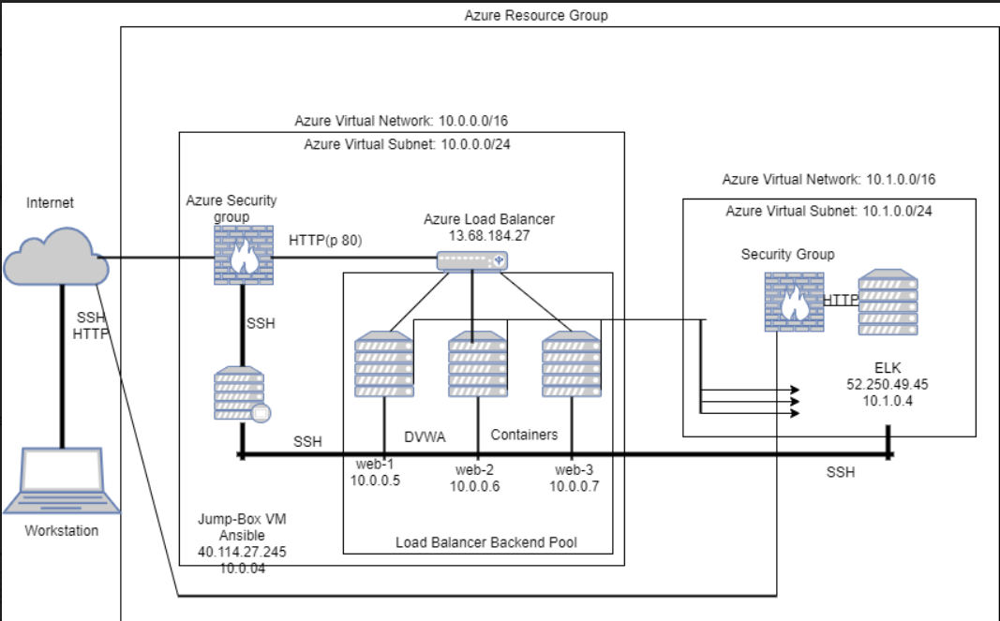
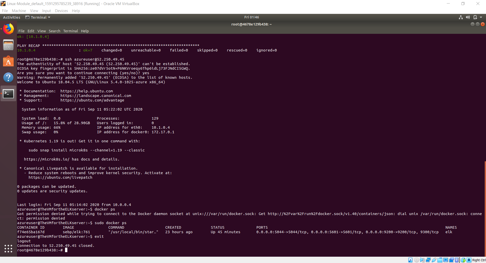
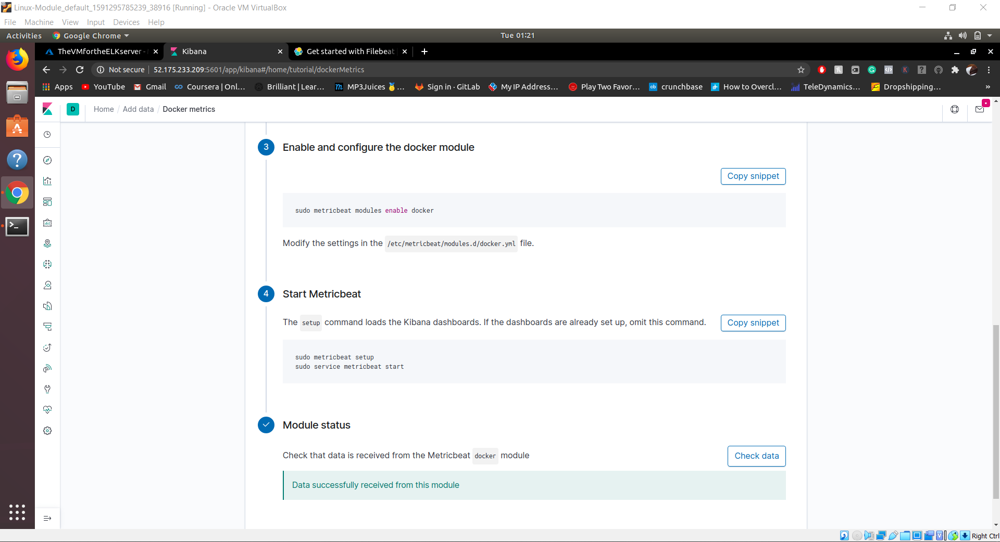

# ELK-Stack-Project-Week
## Automated ELK Stack Deployment

The files in this repository were used to configure the network depicted below.



These files have been tested and used to generate a live ELK deployment on Azure. They can be used to either recreate the entire deployment pictured above. Alternatively, select portions of the Ansible-playbook file may be used to install only certain pieces of it, such as Filebeat.

  ```yaml
  ---
- name: installing and launching filebeat
  hosts: elk
  become: yes
  tasks:

  - name: download filebeat deb
    command: curl -L -O https://artifacts.elastic.co/downloads/beats/filebeat/f$

  - name: install filebeat deb
    command: dpkg -i filebeat-7.4.0-amd64.deb

  - name: drop in filebeat.yml
    copy:
      src: /etc/ansible/files/filebeat-config.yml
      dest: /etc/filebeat/filebeat-yml

  - name: enable and configure system module
    command: filebeat modules enable system

  - name: setup filebeat
    command: filebeat setup

  - name: start filebeat service
    command: service filebeat start
```
  
This document contains the following details:
- Description of the Topologu
- Access Policies
- ELK Configuration
  - Beats in Use
  - Machines Being Monitored
- How to Use the Ansible Build


### Description of the Topology

The main purpose of this network is to expose a load-balanced and monitored instance of DVWA, the D*mn Vulnerable Web Application.

Load balancing ensures that the application will be highly reliable and availiability by monitoring the "health" of applications and only sending requests to servers and applications that can respond in a timely manner., in addition to restricting DDOS to the network.
-  What aspect of security do load balancers protect? 
Load balancers detect the health of back end resources and do not send traffic to servers that are not able to fulfill request. Preventing from DDOS attacks.
What is the advantage of a jump box?_
By focusing on the interactions between the routers instead of all of the machines, we only have to worry about a few connections between a few machines, rather than connections between all machines.
Integrating an ELK server allows users to easily monitor the vulnerable VMs for changes to the servers and system logs.
- Filebeat collects data about the file system.
- Metricbeat collects machine metrics, such as uptime.

The configuration details of each machine may be found below.

| Name     | Function | IP Address | Operating System |
|----------|----------|------------|------------------|
| Jump Box | Gateway  | 10.0.0.4   | Linux            |
| Web-1    | VM       | 10.0.0.5   | Linux            |
| Web-2    | VM       | 10.0.0.6   | Linux            |
| Web-3    | VM       | 10.0.0.7   | Linux            |

### Access Policies

The machines on the internal network are not exposed to the public Internet. 

Only the Jumpbox machine can accept connections from the Internet. Access to this machine is only allowed from the following IP addresses:
- _ 71.230.115.187_

Machines within the network can only be accessed by SSH port.
- Which machine did you allow to access your ELK VM? What was its IP address?_
Jumpboxprovisioner, 71.230.115.187
A summary of the access policies in place can be found in the table below.

| Name     | Publicly Accessible | Allowed IP Addresses |
|----------|---------------------|----------------------|
| Jump Box | Yes/No              | 10.0.0.5 10.0.0.6    |
|          |                     | 10.0.0.7 10.1.0.4    |
|          |                     |                      |

### Elk Configuration

Ansible was used to automate configuration of the ELK machine. No configuration was performed manually, which is advantageous because...
Ansible reads YAML code. YAML stands for YAML ain’t markup language and is designed to be very readable and easy to write.

The playbook implements the following tasks:
- _Download the .deb for filebeat.
- _Install the filebeat.
- _configure the filebeat.config then launch the filebeat.

The following screenshot displays the result of running `docker ps` after successfully configuring the ELK instance.




### Target Machines & Beats
This ELK server is configured to monitor the following machines:
- _10.0.0.4
- _10.0.0.5
- _10.0.0.6
- _10.0.0.7

We have installed the following Beats on these machines:
- _Filebeat_
- _Metricbeat_
These Beats allow us to collect the following information from each machine:
- _`Filebeat` monitors the log files or locations that you specify, collects log events, and forwards them either to Elasticsearch or Logstash for indexing._
- _`Metricbeat` collect metrics from the operating system and from services running on the server._
### Using the Playbook
In order to use the playbook, you will need to have an Ansible control node already configured. Assuming you have such a control node provisioned: 

SSH into the control node and follow the steps below:
- Copy the `filebeat-configuration.yml` file to `filebeat.yml`.
- Update the `filebeat.yml` file to include elkserver.
- Run the playbook, and navigate to `/etc/filebeat/` to check that the installation worked as expected.

_TODO: Answer the following questions to fill in the blanks:_
- _filebeat-playbook.yml is the playbook and you can copy it from `https://github.com/Sawkoeko/ELK-Stack-Project-Week.git`._
- _ update `ansible.cfg` toto make Ansible run the playbook on a specific machine. Update `hosts`to pecify which machine to install the ELK server on versus which to install Filebeat._
- _In order to check that the ELK server is running navigate to`http://[your.ELK-VM.External.IP]:5601/app/kibana`.

_As a **Bonus**,
_ "curl" to download the playbook, "sudo nano" to update the files._
